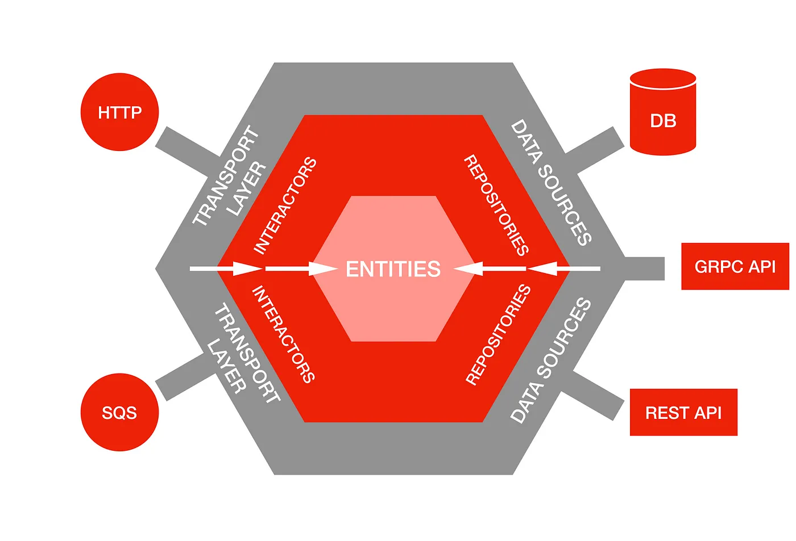
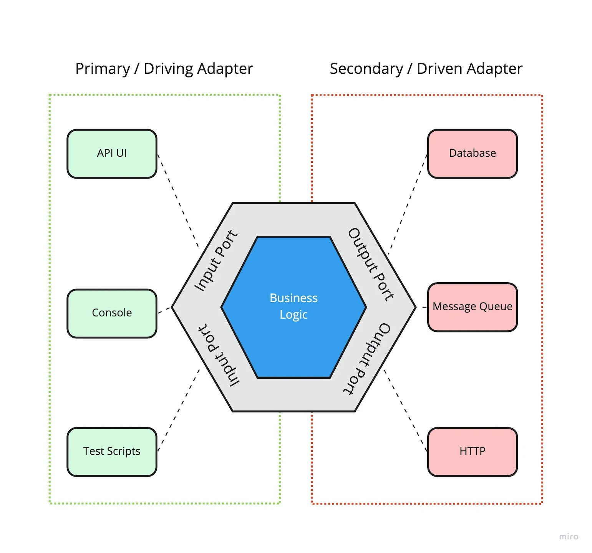

_Hexagonal Architecture (a.k.a Ports & Adapters, Clean Architecture, etc.) is a pattern in software devlopment that describes how to effectively achieve 'separation of concerns.'_

### *So. Many. Packages.*

Software engineering has evolved over time to require us to write less code than ever before. Think about how incredibly easy it is to learn to publish a package with utility functions to your favorite registry. There seems to be a Javascript package to do [just about anything](https://dev.to/codesphere/javascript-flaws-5-stupid-npm-packages-5fi) these days 😅

These integrations present risks for our application. Imagine a package becomes outdated, begins to fail testing, or worse, has security vulnerabilities. The Clean Code mantra of wrapping third-party dependencies (via the [Dependency Inversion Principle](https://github.com/ryanmcdermott/clean-code-javascript#dependency-inversion-principle-dip)) is important in redcuing bloat and the risk of using "bad" packages.

But what about other integration points? How do we manage DBs and cloud services? How about fully-bootstrapped frameworks?

### *Customers Don't Care About Your Tech Stack*

Ultimately, we need to avoid being tied to something that may change in the future. Instead, we should focus on designing our applications focused on solving business problems rather than picking technologies. [Hexagonal Architecture](https://alistair.cockburn.us/hexagonal-architecture/), as proposed by Alistair Cockburn, describes how to create apps that are "developed and tested in isolation from its eventual run-time devices and databases."


<span style="text-align: center; color:#777">A dependency diagram from Netflix's Medium Blog</span>

This diagram from [Netflix's Blog](https://netflixtechblog.com/ready-for-changes-with-hexagonal-architecture-b315ec967749) expounds on the fundamental idea that core business logic shouldn't be part of code that orchestrates APIs and DBs. Developers should focus on creating the core functionality, as represented by the center, _before_ any decision is even made on which technologies to use, as represented by the outermost layer.

### *Layers*

The dependency flow points inwards to convey that each layer can't be dependent on the layer outside of it. A layer can *only* depend on components either at the same level or further in.

- *Entities* - The core domain objects in our application which have no dependencies and are independently testable.

- *Interactors & repositories* - **Interactors** are service objects that have business logic. They're called by the outer layer and "protect" the app's entities through input validation. Interactors utilize **repositories** to retrieve data to perform its logic. Repositories are interfaces for data sources. Whether that data source be a NoSQL DB or an API doesn't matter to an interactor.

- *Data Sources & Transport* - **Data Sources** are concrete implementations of repositories. This could be APIs, DBs, excel sheets, S3 buckets, etc. as long as they fulfill the contract of the interface. **Transport** is also concrete but doesn't necessarily implement an interface. They provide a mechanism for a client to interact with the app and call the appropriate interactor through its methods or functions. Some implementations include REST, gRPC, and CLI.

The practical purpose of putting data sources and transport on the outer banks of an application are to make them **swappable**. If an API becomes expensive or unreliable, you can reevaluate and implement a new data source just by following the repository interface. If you need to rapidly prototype, maybe your transport-of-choice is CLI. Then after the first iteration, you could swap it out for a web framework.

**Note**: Hexagonal Architecture goes by many names. One of those names for the pattern is *Ports & Adapters*. The repositories (interfaces for data) of our application are considered "**ports**" and the concrete implementation (actual data sources and transport) are the "**adapters**." Interactors are still considered services.

It's simpler than differentiating between a "repository" and a "data source" because those names could be interchangeable in other contexts.


<span style="text-align: center; color:#777">Ports & Adapters diagram from https://medium.com/idealo-tech-blog/hexagonal-ports-adapters-architecture-e3617bcf00a0</span>

Let's go ahead and build a basic app to demonstrate these concepts 🚀

### *The App*

**Note**: To follow along with the full code for the project, [click here](https://github.com/ShababKarim/my-blog-code/tree/main/hexagonal-architecture).

Let's define the requirements for this project.

**Requirements**: The app will give customers the ability to quickly get issues on their open-source project assigned to interested engineers. Engineers will be able to register themselves to the service. They can also update their progress on an assigned issue. Not every piece of functionality must be built, like updating an engineer's interests. Certain components can be mocked.

Sounds easy enough! We'll take it piece-by-piece.

We'll use [BunJS](https://bun.sh/) as the runtime for our application. If you're not familiar, BunJS is a drop-in replacement for Node and has great support for Typescript!

We'll start by installing BunJS and generating our project:

```bash
curl -fsSL https://bun.sh/install | bash # Install Bun

bun init # Create a Bun project
```

#### *Entities & Commands*

Once our project structure is created we'll move the index.ts file into a `src/` directory to keep the root of the project clean.

We'll also create a `src/domain/` directory to house domain-related code. At the root here will be the entities of our app: projects and engineers.

```
├── src
│   ├── domain
│   │   ├── project.ts
│   │   └── engineer.ts
│   └── index.ts
└── tsconfig.json
```

```javascript
// project.ts

export function generateId(account: string, name: string) {
    return account.concat('/').concat(name);
}

export interface Project {
    id: string; // ID is account/name
    account: string;
    name: string;
    issues: Issue[];
}

export interface Issue {
    url: string; // ID
    title: string;
    description: string;
    reporter: string;
    assignedEngineer: Engineer | undefined;
    status: Status;
    lastUpdated: Date;
}

export enum Status {
    NOT_YET_STARTED = 'NOT YET STARTED',
    STARTED = 'STARTED',
    DONE = 'DONE',
    BLOCKED = 'BLOCKED',
}

// engineer.ts

export interface Engineer {
    email: string; // ID
    name: string;
    interestedProjects: string[];
}
```

These TS interfaces are the core carriers of information within our app. When we think about our requirements spec, the first thing that jumps to mind is that there are open-source projects with issues and engineers to work on them. So we model them accordingly without thinking about extra details like normalized table design. We are trying to reflect the language of the problem accurately and concisely.

We'll also create another set of domain objects called `commands` in `src/domain/`.

```javascript
// commands.ts

export interface RegisterEngineer {
    name: string;
    email: string;
}

export interface MatchEngineerToProject {
    account: string;
    name: string;
}

export interface UpdateIssueStatus {
    projectId: string;
    issueUrl: string;
    newStatus: Status;
}
```

The 3 APIs we mentioned at the outset: registering engineers, matching engineers to issues, and updating an issue's status are shown here.

This is because we are now thinking about how a client will interact with our app. What sort of APIs are we exposing to the outside world? How much data do we require to perform these functions?

Commands are the currency between the outside world and our services 💸


#### *Interactors & Repositories (ports)*

The first step in implementing business logic is creating input and output port interfaces so they can be wired up to our interactors.

Inside of src/domain we'll add 2 directories: `src/domain/ports/input/` and `src/domain/ports/output/`

```
├── domain
│   ├── ports
│   │   ├── input
│   │   └── output
└── index.ts
```

Let's create 2 output ports: 1 for retrieving a project's issue list and the other to talk to our DB.

```javascript
// project.ts

export interface ProjectApi {
    getRepoDetails(account: string, name: string): Promise<Project>;
}


// repository.ts

export interface Repository<T, V> {
    getAll(): Promise<T[]>;
    getById(id: V): Promise<T | undefined>;
    save(entity: T): Promise<T>;
    saveAll(entities: T[]): Promise<T[]>;
}
```

They are essentially just contracts that no matter what adapter we wire-in to retrieve data, the adapter will need to support these methods and not break our app.

Going back to our directory structure, we have input ports we need to define. In P&A, these are called "driving ports" because they allow communication from the outside world. Although the inner layers of our app won't depend on them, they, like ouput ports, are contracts for the type of transport we choose to use.

For our app, we'll define a web port in `src/domain/input.`

```javascript
// web.ts

export enum HttpVerb {
    GET = 'GET',
    POST = 'POST',
    PUT = 'PUT',
    DELETE = 'DELETE',
}

export interface Route<T> {
    verb: HttpVerb;
    path: string;
    handler: T;
}

export interface WebServer<T> {
    addRoute(route: Route<T>): WebServer<T>;
    listen(port: number): void;
}
```

Finally, we'll tackle our interactors. Inside `src/domain/` create a directory called `service/`. It'll house all the necessary business logic. For each of the 3 commands we create functions as handlers:

```javascript

// assignment.ts

export async function matchEngineerToProject(
    projectApi: ProjectApi,
    engineerRepository: Repository<Engineer, string>,
    projectRepository: Repository<Project, string>,
    command: MatchEngineerToProject
): Promise<Project> {
    validateMatchEngineerToProjectCommand(command);

    const project = await getOrUpdateProject(projectApi, projectRepository, command);
    const interestedEngineers = await getInterestedEngineers(engineerRepository, project.id);

    const projectWithAssignedIssues = assignIssuesToEngineers(project, interestedEngineers);
    projectRepository.save(projectWithAssignedIssues);

    return projectWithAssignedIssues;
}

// register.ts

export async function registerEngineer(
    repository: Repository<Engineer, string>,
    command: RegisterEngineer
): Promise<Engineer> {
    if (!isValidEmailAndName(command)) {
        throw new Error(`Cannot register user with invalid email and/or name`);
    }

    const engineerExists = await repository.getById(command.email);
    if (engineerExists) {
        throw new Error(`Cannot register ${command.email}. A user with that email already exists`);
    }

    return repository.save({ ...command, interestedProjects: [] }).then((engineer) => {
        return engineer;
    });
}

// status.ts

export async function updateIssueStatus(
    projectRepository: Repository<Project, string>,
    command: UpdateIssueStatus
): Promise<Project> {
    validateUpdateIssueStatusCommand(command);

    const projectWithUpdatedIssue = await updateProjectIssues(projectRepository, command);

    return projectRepository.save(projectWithUpdatedIssue);
}
```

The logic of these functions are relatively simple: validate the input, update the entity, and save back to the DB. If someone wanted to change the DB at runtime, it would be easy to swap because the service depends strictly on interfaces.

#### *Transport & Data Sources (Adapters)*

We've delayed long enough! This is the stage where we start to think about wiring the app to external services. I decided to forego adding a DB and instead chose to hold the data in-memory. As you'll see below, there is room to change the implementation and connect to a DB if you need to.


We'll begin by creating a directory in `src/domain/output/` called `adapters/` and add:

```javascript

// project-repository.ts

export class ProjectRepository implements Repository<Project, string> {
    projects: Project[];

    constructor() {
        this.projects = [];
    }

    getAll(): Promise<Project[]> {
        return Promise.resolve(this.projects);
    }

    // Omitted for brevity
}

// engineer-repository.ts

export class EngineerRepository implements Repository<Engineer, string> {
    engineers: Engineer[];

    constructor() {
        this.engineers = [
            {
                email: 'bob@gmail.com',
                name: 'bob',
                interestedProjects: ['spring-projects/spring-boot', 'facebook/react-native'],
            },
            {
                email: 'alice@gmail.com',
                name: 'alice',
                interestedProjects: ['facebook/react-native'],
            },
        ];
    }

    getAll(): Promise<Engineer[]> {
        return Promise.resolve(this.engineers);
    }

    // Omitted for brevity
}

// github-project-api.ts

export class GithubProjectApi implements ProjectApi {
    async getRepoDetails(account: string, name: string): Promise<Project> {
        if (this.isInvalidAccountAndRepo(account, name)) {
            throw new Error('Cannot retrieve project with invalid account and/or repo name');
        }

        const issuesList = await fetch(this.generateApiUrl(ISSUES_API, account, name)).then(
            (res) => res.json() as any
        );

        return {
            // Omitted for brevity
        };
    }
}
```
**Note**: The data is saved in-memory for projects and engineers but we source the project and issue data directly from Github.

Then we'll wire up the input port. We're going to opt for a Bun web framework called [ElysiaJS](https://elysiajs.com/).

We can install Elysia as a dependency by running:

```bash
bun add elysia
```
Then we'll create a directory in `src/domain/input/` called `adapters/` and add:

```javascript
// controller.ts

// Ommitted for brevity

export function startApp(port: number) {
    const engineerRepository = new EngineerRepository();
    const projectRepository = new ProjectRepository();
    const projectApi = new GithubProjectApi();

    new ElysiaServer()
        .addRoute({
            verb: HttpVerb.POST,
            path: '/register',
            handler: async ({ body }) => {
                return await registerEngineer(engineerRepository, body as RegisterEngineer);
            },
        })
        .addRoute({
            verb: HttpVerb.POST,
            path: '/assign',
            handler: async ({ body }) => {
                return await matchEngineerToProject(
                    projectApi,
                    engineerRepository,
                    projectRepository,
                    body as MatchEngineerToProject
                );
            },
        })
        .addRoute({
            verb: HttpVerb.POST,
            path: '/update',
            handler: async ({ body }) => {
                return await updateIssueStatus(projectRepository, body as UpdateIssueStatus);
            },
        })
        .listen(port);
}

```

Here we've created a function to create the necessary dependencies and an instance of a web server to handle user input. The web adapter calls the appropriate interactor based on the endpoint and passes a command.

We'll plug this back into to `index.ts` like so:

```javascript
// index.ts

import { startApp } from './domain/ports/input/adapters/controller';

startApp(8080);
```

and voila! We have a complete web application!

Let's run some commands and see the output!

#### *Running the app*

First we'll register a new user:

`POST http://localhost:8080/register {"email": "casey@gmail.com", "name": "casey"} `


```
$ bun src/index.ts
Starting server on port 8080...
Retrieving engineer by id casey@gmail.com
Saved/updated engineer with id casey@gmail.com
Registered new user casey@gmail.com
```

Then assign interested engineers to my favorite open-source project ❤️:

`POST http://localhost:8080/assign {"account": "spring-projects", "name": "spring-boot"}`


```
Retrieving repo by id spring-projects/spring-boot
Retrieved 30 issue(s) for account/repo: spring-projects/spring-boot
Saved/updated repo with id spring-projects/spring-boot
Retrieving all engineers
Assigning 30 issue(s) across 1 interested engineer(s) for project spring-projects/spring-boot
Assigned 30 issue(s) for project spring-projects/spring-boot
Saved/updated repo with id spring-projects/spring-boot
```

And finally update an issue's status to `STARTED`:

`POST http://localhost:8080/update {"projectId": "spring-projects/spring-boot", "issueUrl": "https://api.github.com/repos/spring-projects/spring-boot/issues/39331", "newStatus": "STARTED"}`


```
Retrieving repo by id spring-projects/spring-boot
Updated issue https://api.github.com/repos/spring-projects/spring-boot/issues/39331 with status STARTED for project spring-projects/spring-boot
Saved/updated repo with id spring-projects/spring-boot
```

There we go! We've validated all three APIs that were mentioned in the requirements 🥳

### *Wrapping Up*

Hexagonal Architecture helps a lot in separating our business logic from code that interacts with our dependencies. Without worrying about external services, we can rapidly develop the first iteration of our product and get feedback before making it production-ready.

Whether in the future you choose to use Postgres, MonogDB, Kafka, SQS, MongoDB, etc. it's all about **delaying** your decision. There **should be** no lock-in to a particular technology because of the problem you are trying to solve.

However, there are always edge-cases where a specific tool must be used. The goal then, should be to minimize them as much as possible.

Beyond this dicussion, keep learning good design principles and exercising sound judgement. The rest will eventually fall into place.

Thanks for reading! Please leave some feedback by sending me a message on LinkedIn and stay tuned for the next article 😊